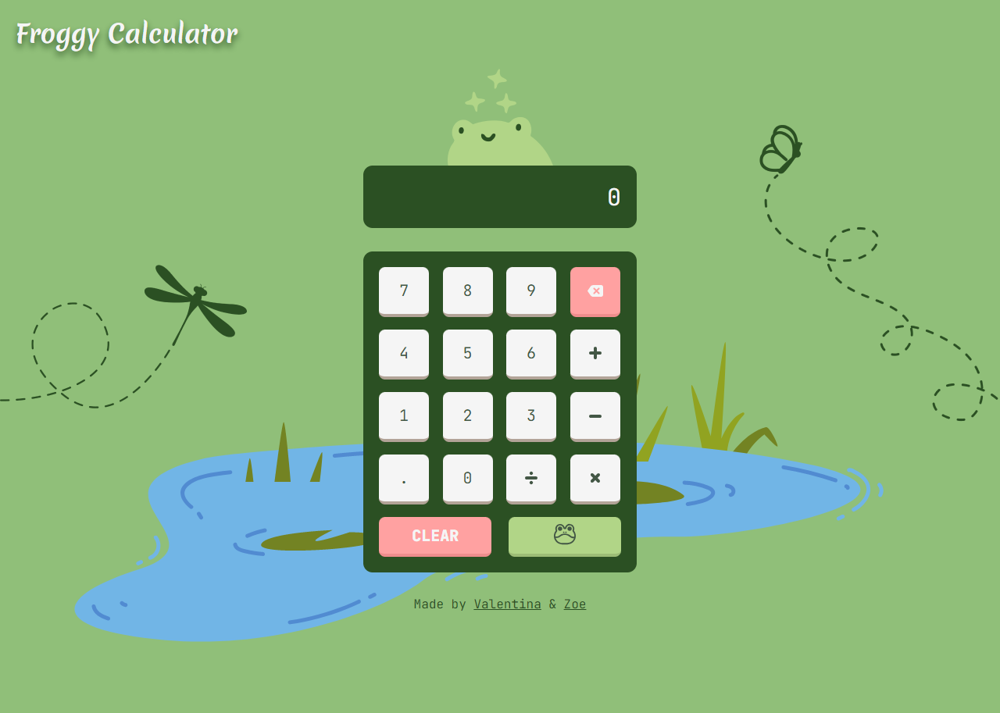
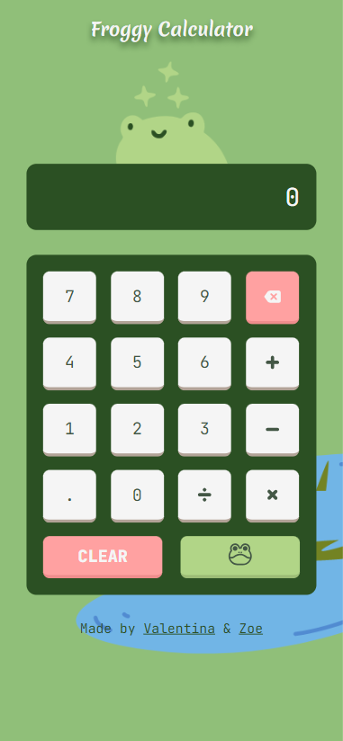

# Froggy Calculator - Calculator Group Project

This project was created for the Full Stack Web Development Course from [SomosCoders](https://somoscoders.org/es).

## Overview

### The Task

Users should be able to:

- View the optimal layout for the site depending on their device's screen size
- Use the calculator for basic operations like addition, subtraction, division and multiplication.
- Hear a frog sound whenever they click the "equals" button.

### Screenshots & Figma

[Figma File](https://www.figma.com/file/9B0zK2KnGMCbGfxqEd3sGP/Calculadora?type=design&node-id=12%3A23&t=5DSQrWp7HMXoiebP-1)

### Live Site

- Live Site URL: [Froggy Calculator](https://froggy-calculator.vercel.app/)

### Built with

- Semantic HTML5 markup
- CSS custom properties
- Flexbox
- JavaScript
- Mobile-first workflow

## Authors

- Linkedin - [Valentina Belén Sánchez](https://www.linkedin.com/in/valentina-belen-sanchez/)
- Github - [ValentinaBS](https://github.com/ValentinaBS)
- Github - [ZoeC21](https://github.com/ZoeC21)

---

# Calculadora Froggy - Proyecto de Calculadora Grupal

Este proyecto fue creado para el curso de Desarrollo Web Full Stack de [SomosCoders](https://somoscoders.org/es).

## Visión General

### La Tarea

Los usuarios deberían ser capaces de:

- Ver el diseño óptimo del sitio en función del tamaño de la pantalla de su dispositivo.
- Utilizar la calculadora para operaciones básicas como sumas, restas, divisiones y multiplicaciones.
- Oír un sonido de rana cada vez que pulsen el botón "igual".

### Screenshots & Figma

[Archivo de Figma](https://www.figma.com/file/9B0zK2KnGMCbGfxqEd3sGP/Calculadora?type=design&node-id=12%3A23&t=5DSQrWp7HMXoiebP-1)

### Sitio Web

- URL del Sitio: [Calculadora Froggy](https://froggy-calculator.vercel.app/)

### Hecho con

- HTML5 Semántico
- CSS
- Flexbox
- JavaScript
- Flujo de trabajo Mobile-first

## Autoras

- Linkedin - [Valentina Belén Sánchez](https://www.linkedin.com/in/valentina-belen-sanchez/)
- Github - [ValentinaBS](https://github.com/ValentinaBS)
- Github - [ZoeC21](https://github.com/ZoeC21)
